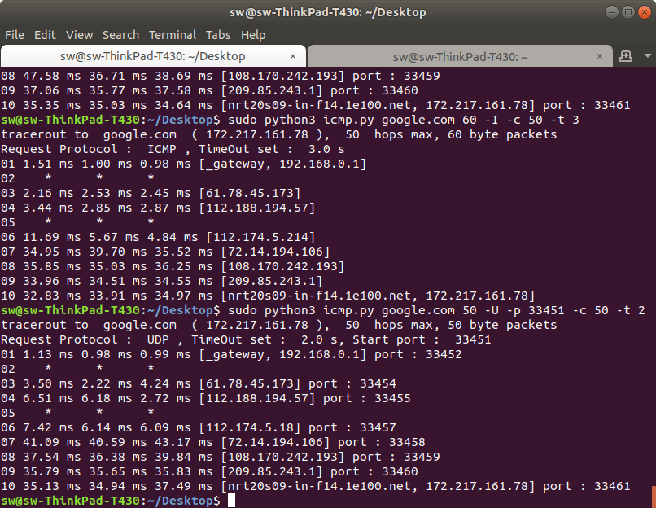

# Term Project 

### 기기괴괴 조 : 전승원(2015040044), 신영호(2015040035)

-  Traceroute 작성
	- send 소켓 : socket(socket.AF_INET, socket.SOCK_RAW, socket.IPPROTO_RAW)
	- struct 모듈을 사용해 직접 IP, ICMP, UDP의 내용 작성
	- host : 목적지 ip 주소 혹은 도메인 네임, size : 패킷의 사이즈(IP헤더부터)
	- -t : RECV TIMEOUT, -c : MAX_HOPS
	- -I : ICMP, -U : UDP, -p : UDP 포트번호(기본 53)
	- 스니핑할 때 자신이 보낸 UDP, ICMP인지 확인하는 로직 작성

