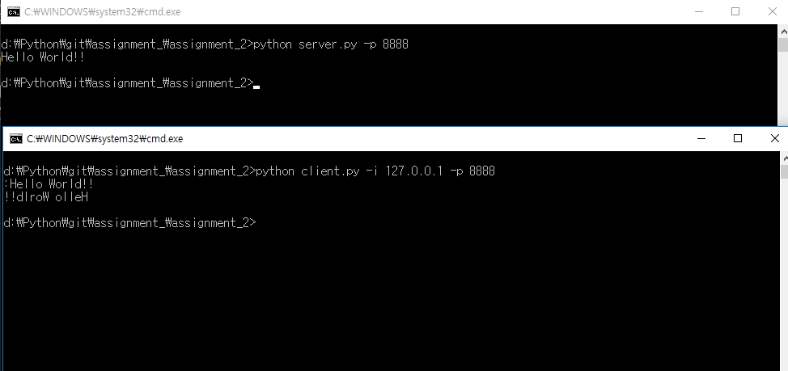

# 1주차 과제 : Python을 이용한 Quick Sort

### 기기괴괴 조 : 전승원(2015040044), 신영호(2015040035)

-  client.py
     -  -i: 서버아이피  -p: 포트번호
-  server.py
	 -  -p: 포트번호

<pre><code>python server.py -p 8888</code></pre>
<pre><code>python client.py -i 127.0.0.1 -p 8888</code></pre>
<pre><code>Hello world!!</code></pre>

