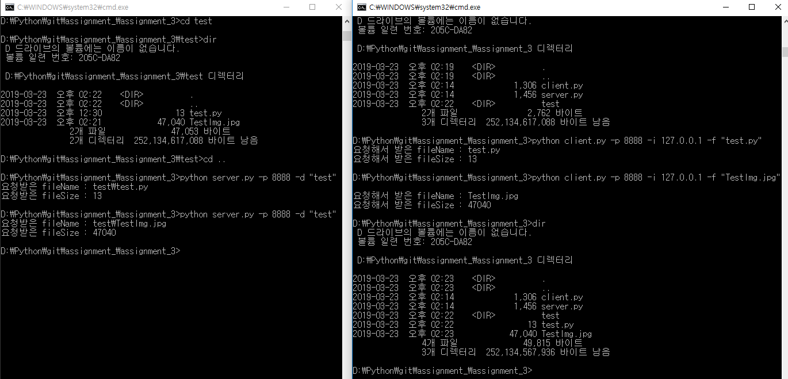

# 3주차 과제 : 클라이언트가 요청한 파일을 전송해주는 서버 구현

### 기기괴괴 조 : 전승원(2015040044), 신영호(2015040035)

-  client.py
     -  -i: 서버아이피,  -p: 포트번호, -f: 파일이름
-  server.py
	 -  -p: 포트번호, -d: 파일 디렉토리

<pre><code>python server.py -p 8888 -d /home/famous/ </code></pre>
<pre><code>python client.py -i 127.0.0.1 -p 8888 -f test.txt </code></pre>

