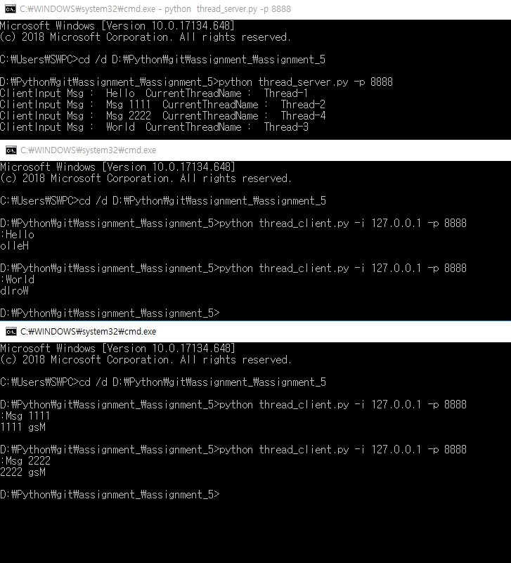

# 5주차 과제 : threading 모듈을 사용해 다수의 client의 요청을 받을 수 있는 서버 작성

### 기기괴괴 조 : 전승원(2015040044), 신영호(2015040035)
- 서버는 클라이언트가 전송한 문자열을 뒤집어서 클라이언트에게 전송해준다.
- 클라이언트는 서버 연결 후 input() 함수를 사용해 사용자로부터 문자열을 입력 받는다.
-  client.py
     -  -i: 서버아이피,  -p: 포트번호
-  server.py
	 -  -p: 포트번호

<pre><code>python thread_server.py -p 8888 </code></pre>
<pre><code>python thread_client.py -i 127.0.0.1 -p 8888 </code></pre>

