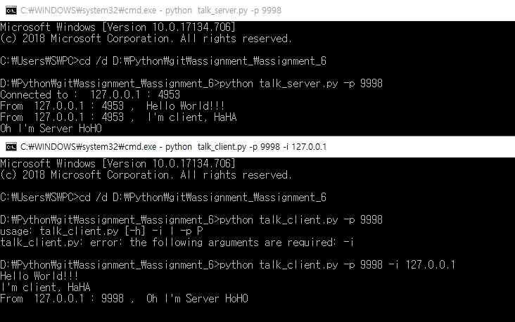

# 6주차 과제 : threading 모듈을 사용해 서버와 클라이언트가 대화를 주고 받을 수 있는 프로그램 작성

### 기기괴괴 조 : 전승원(2015040044), 신영호(2015040035)
- 서버는 클라이언트가 전송한 문자열 출력, input()으로 사용자 입력을 받아서 클라이언트에 전달
- 클라이언트는 서버가 전송한 문자열 출력, input()으로 사용자 입력을 받아서 서버에 전달
- 난이도 조절을 위해 서버는 1개의 클라이언트만 처리
-  talk_client.py
     -  -i: 서버아이피,  -p: 포트번호
-  talk_server.py
	 -  -p: 포트번호

<pre><code>python talk_server.py -p 8888 </code></pre>
<pre><code>python talk_client.py -p 8888 -i 127.0.0.1 </code></pre>

