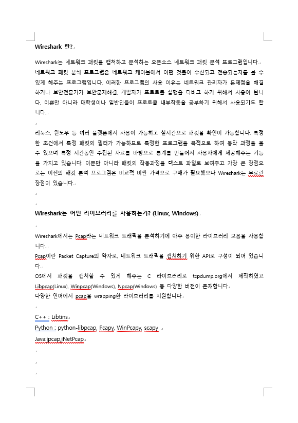

# 과제7 : Wireshark 프로그램에 대해서 조사한 뒤 보고서 작성

### 기기괴괴 조 : 전승원(2015040044), 신영호(2015040035)

-  Wireshark 프로그램에 대해서 조사
	- Wireshark 프로그램이란?
	- Wireshark는 어떠한 라이브러리를 사용하는가?(Linux, Windows)
	- Wireshark로 Assignment#2(문자열 거꾸로 전송)가 실행 되면서 서버-클라이언트간
	  주고받은 TCP 패킷을 캡쳐해서 사진첨부(문자열은 팀 이름을 전달)
	- 보고서는 3장 내로 작성(1~2장 : wireshark 조사, 3장 : 패킷 캡쳐 사진 및 설명)
	

