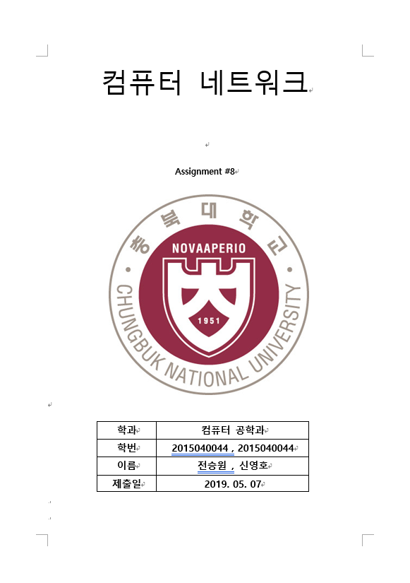
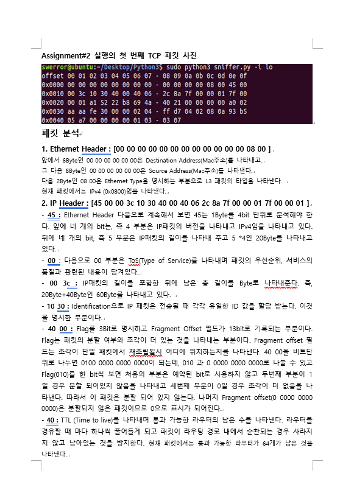
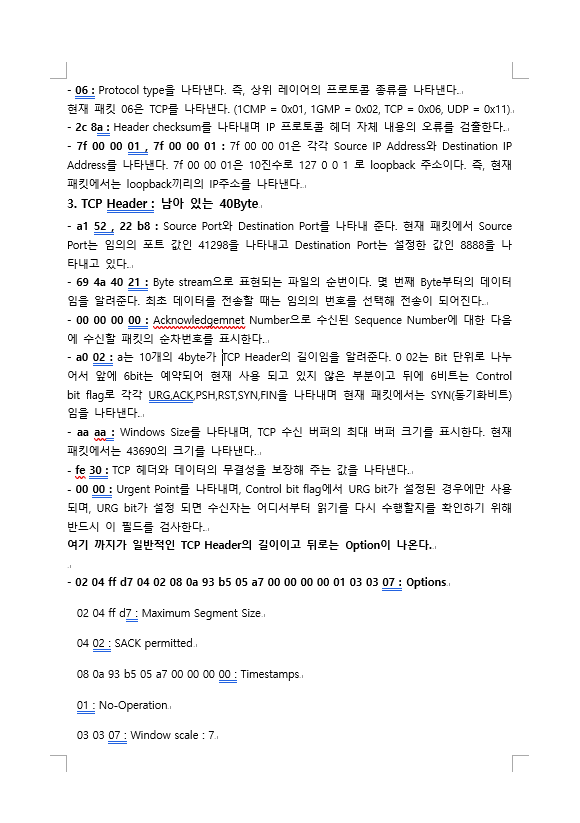

# 과제8 : raw_sniffer.py를 사용한 패킷 분석

### 기기괴괴 조 : 전승원(2015040044), 신영호(2015040035)

-  수업 Github assignment_8에 있는 raw_sniffer.py를 사용한 패킷 분석
	- Linux에서 수행할 것
	- raw_sniffer.py로 Assignment#2(문자열 거꾸로 전송)가 실행되면서 서버-클라이언트간
	  주고받은 첫 번쨰 TCP 패킷을 캡처해 사진 첨부(문자열은 팀 이름을 전달)
	- 캡처한 패킷을 상세히 분석
	- 보고서는 2장 내로 작성
	

