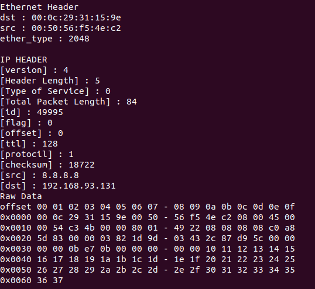

# 과제9 : IP packet parsing

### 기기괴괴 조 : 전승원(2015040044), 신영호(2015040035)

-  Linux에서 IP PAcket을 수신해 Ethernet 헤더, IP 헤더, 페이로드 를 출력하는 프로그램 작성
	- AF_PAcket을 사용하고 PROTOCOL_TYPE은 ETH_P_ALL을 사용.
	- Ethernet 헤더 파싱 후 Ether_type을 통해 IP 패킷인지 검사 후 IP 패킷일 때만 출력
	- IP 헤더는 헤더의 길이를 먼저 구한 뒤 옵션을 제외한 길이에 맞게 파싱
	- While 루프를 통해 여러 번 동작하도록 설정
	- 프로그램 실행 뒤 google.com에 PING을 1번 보낸 결과를 캡쳐해 첨부
	

